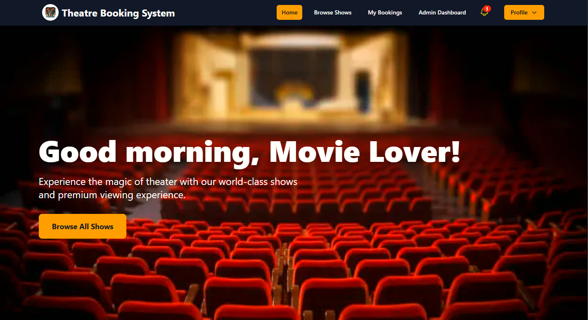

# 🎭 Theatre Booking System - Frontend

A modern and responsive frontend for an online theatre booking platform, designed to provide a seamless user experience for browsing shows, booking seats, making payments, and managing profiles. Built using React and Tailwind CSS, with integration to a Supabase-powered backend.
 

## 📸 Screenshots

| Home Page | Booking Page |
|-----------|--------------|
| |  |   | 

---

## ✨ Features

- 🎫 Browse shows and view show details
- 🪑 Real-time seat selection with availability status
- 💳 Khalti payment integration for booking
- 🔐 User authentication and profile management
- 📅 Booking history and review system
- 🧑‍💼 Admin dashboard for managing users, bookings, and shows
- 📱 Fully responsive UI for all devices

---

## 🛠 Tech Stack

- **Frontend**: React, Tailwind CSS
- **Routing**: React Router DOM
- **API & State**: Axios, useContext, useEffect
- **Authentication**: Supabase Auth
- **Payment**: Khalti Payment Gateway

---

## 🚀 Getting Started

Follow these steps to run the project locally:

```bash
# Clone the repository
git clone https://github.com/rajanshah23/frontend-Theatre-booking-system

# Navigate to the project directory
cd frontend-Theatre-booking-system

# Install dependencies
npm install

# Start the development server
npm run dev
